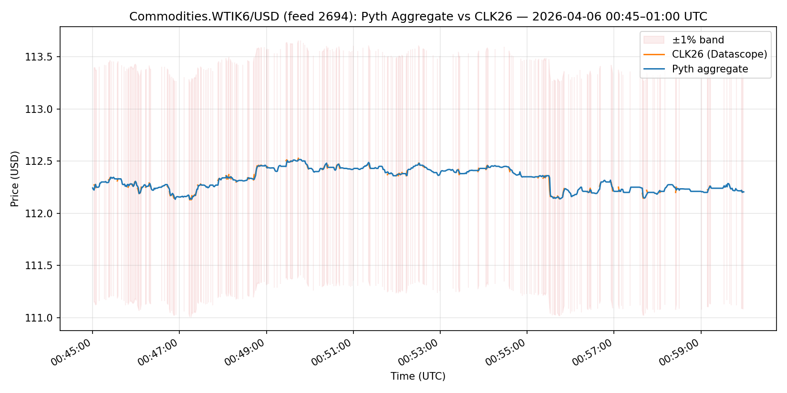
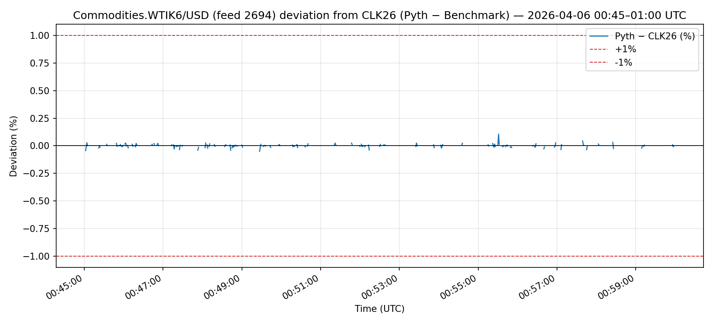

# WTIK6 Pyth Aggregate vs CLK26 — 2026-04-06 00:45–01:00 UTC

**Feed:** `2694` (`Commodities.WTIK6/USD`)
**Benchmark:** CLK26 (`datascope_futures_benchmark_data`, `pyth_lazer_id = 2694`)
**Window:** 2026-04-06 00:45:00 to 2026-04-06 01:00:00 UTC
**Threshold:** ±1%

## Verdict

Pyth aggregate did not deviate more than 1% from CLK26 during 2026-04-06 00:45:00–01:00:00 UTC.

## Summary stats

- **Max absolute deviation:** 0.1057% (signed +0.1057%) at 00:55:31 UTC
- **Mean absolute deviation:** 0.0113%
- **Min absolute deviation:** 0.0000%
- **Breaches:** 0
- **Joint coverage:** 279/900 seconds (31.0%)
- **Pyth gaps:** 0 seconds with no aggregate data
- **Benchmark gaps:** 621 seconds with no CLK26 data
- **Pyth channel used:** 1

## Charts

## Narrative

_To be filled in after inspecting the charts._

## Caveats

- Deviation metrics are only computed on seconds where both Pyth and CLK26 had data. Gaps on either side are retained in the CSV but excluded from the breach count.
- WTIK6 is a futures contract; liquidity around 00:45–01:00 UTC may be thin, which can show up as benchmark gaps or widened spreads.
- The ±1% threshold applies to the absolute per-second deviation of the Pyth aggregate from the CLK26 mid (or trade when available).
