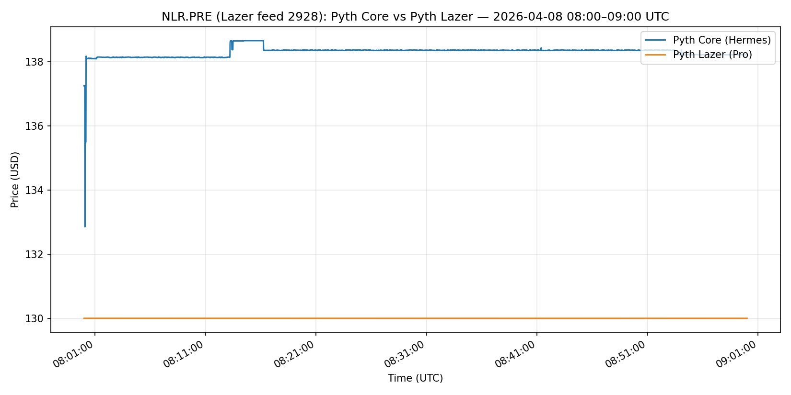
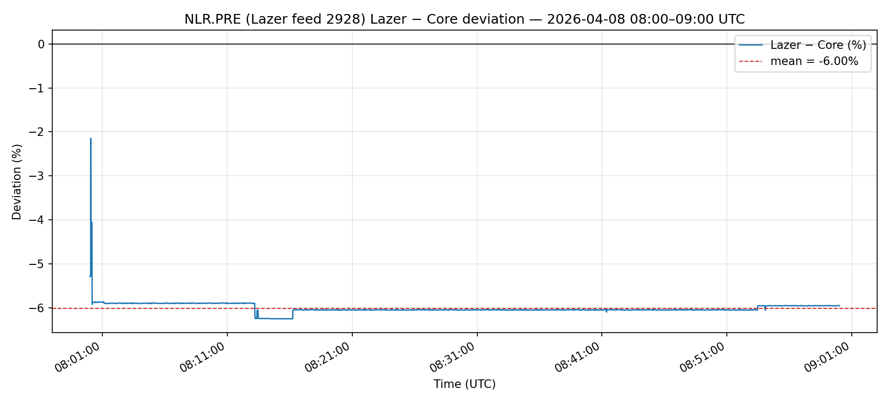
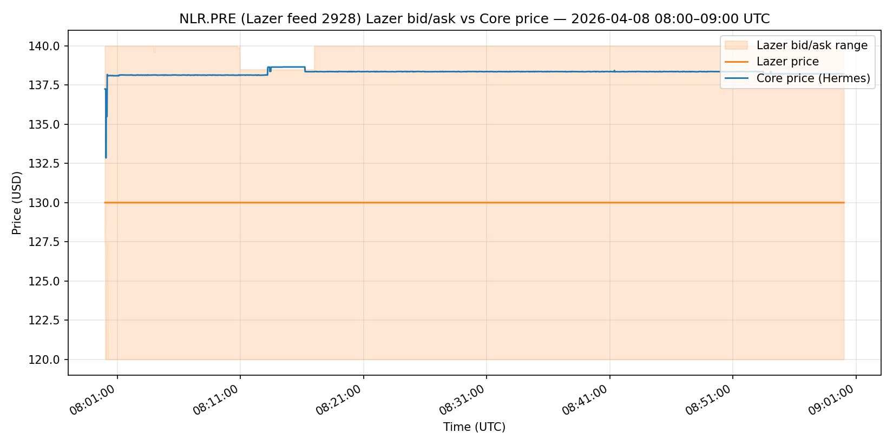

# NLR.PRE — Pyth Lazer vs Pyth Core (2026-04-08 08:00–09:00 UTC)

## Verdict

Pyth Lazer NLR.PRE (feed 2928) was stuck at $130.0019 for the entire 2026-04-08 08:00–09:00 UTC pre-market hour while Pyth Core ranged $132.8548–$138.6585 — a sustained mean deviation of -6.00% ($-8.3036).

## Summary stats

| Metric                         | Value                     |
| ------------------------------ | ------------------------- |
| Max abs deviation (%)          | 6.2434%                   |
| Min abs deviation (%)          | 2.1473%                   |
| Mean abs deviation (%)         | 6.0036%                   |
| Max abs deviation ($)          | $8.6571                   |
| Min abs deviation ($)          | $2.8528                   |
| Mean abs deviation ($)         | $8.3036                   |
| Timestamp of max abs deviation | 2026-04-08T08:14:35+00:00 |
| Mean Lazer spread ($)          | $19.8329                  |
| Mean Lazer confidence ($)      | $10.0018                  |
| Mean Hermes confidence ($)     | $8.3031                   |
| Stuck seconds (%)              | 100.00%                   |
| Hermes price range             | $132.8548 – $138.6585     |
| Hermes first/last price        | $137.2504 / $138.2187     |
| Lazer first/last price         | $130.0019 / $130.0015     |

## Narrative

Pyth Core (Hermes) tracked NLR.PRE between
$132.8548 and $138.6585
through the hour while Pyth Lazer (feed 2928) sat at exactly
$130.0019, putting Lazer's published price
roughly $8.30 below Core for the
entire window. Lazer published an absurd
$19.83-wide bid/ask band and a
confidence interval pinned near $10.00
(its maximum) — i.e. Lazer was already advertising "I do not know this
price" — and the Lazer price moved by less than
$0.01 on 100.0% of
seconds, confirming the feed was effectively frozen. The mean signed
deviation of -6.00% across the full hour
establishes this was a sustained outage, not a transient blip.

## Caveats

- Single price feed id `2928`, single 1-hour pre-market
  window, CSV-driven one-off analysis (not a reusable tool).
- Hermes is used as the reference solely because the user reports Pyth
  Core was correct during this window; this script does not
  independently validate that claim.
- Source data: `2928_nlr_pre_20260408_0800-0900.csv` (this script's own merged per-second
  output).
